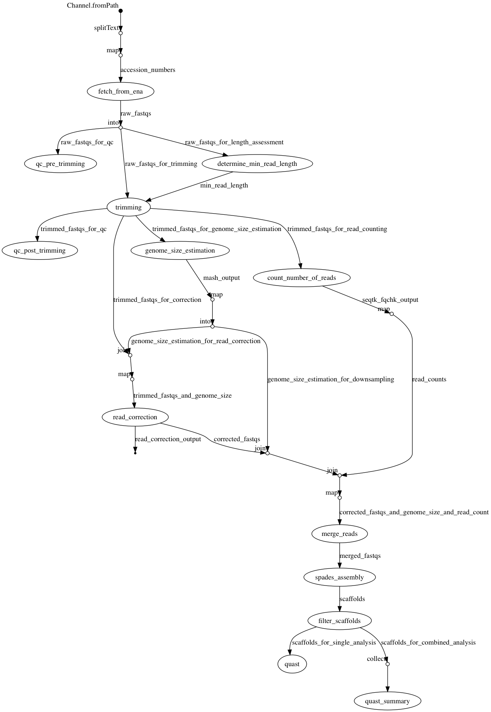

# SPAdes Assembly workflow
This [Nextflow](https://www.nextflow.io/) workflow can be used to process short read fastq files an assembly pipeline using the [SPAdes assembler](http://cab.spbu.ru/software/spades/). Alongside this it will QC the reads before and after trimming and QC the final assembled scaffolds file using [Quast](http://quast.sourceforge.net/quast).

Typically the workflow should be run as follows

```
nextflow run assembly.nf [options] -with-docker bioinformant/ghru-assembly:1.1 -resume 
```
To run the test sets either of the following commands will work
 - Using  local fastqs and no down sampling
    ```
    nextflow run assembly.nf --input_dir test_input --output_dir test_output --fastq_pattern "*_{1,2}.fastq.gz" --adapter_file adapters.fas -with-docker bioinformant/ghru-assembly:1.1 -resume
    ```
 - Using accession numbers to fetch short reads and downsampling to a depth cutofff of 50
    ```
    nextflow run assembly.nf --accession_number_file accessions.txt --output_dir test_output --fastq_pattern "*_{1,2}.fastq.gz" --adapter_file adapters.fas --depth_cutoff 50 -with-docker bioinformant/ghru-assembly:1.1 -resume
    ```

The mandatory options that should be supplied are
  - A source of the fastq files specified as either of the following
    - local files on disk using the `--input_dir` and `--fastq_pattern` arguments
    - from a list of short read archive ERR or SRR accession numbers contained within a file specified by the `--accession_number_file` argument
  - The output from the pipeline will be written to the directory specified by the `--output_dir` argument
  - The path to a fasta file containing adapter sequences to trim from reads specified by the `--adapater_sequences` argument

Optional arguments include
  - `--depth_cutoff` argument. Downsample each sample to an approximate depth of the value supplied e.g 50 means downsample to 50x depth of coverage . If not specified no downsampling will occur
  - The minimum length of a scaffold to keep is specified using the `--minimum_scaffold_length` argument. Others will be filtered out. Default 500 
  - The minimum depth of coverage a scaffold must have in order to be kept is specified by the `--minimum_scaffold_depth` argument. Others will be filtered out. Default 3 

## Workflow process
The workflow consists of the following steps

1. (Optional) Fetch reads from the ENA
2. QC reads using FastQC before trimming
3. Trim reads using trimmomatic (dynamic MIN_LEN based on 30% of the read length)
4. QC reads using FastQC after trimming
5. Correct reads using lighter
6. Count number of reads and estomate genome size using Mash
7. Downsample reads if the `--depth_cutoff` argument was specified
8. Merge reads using Flash where the insert size is small
9. Assemble reads using SPAdes
10. Assess assembly quality using Quast
11. Sumarise all assembly QCs using Quast

A sumary of this process is shown below in the diagram that was generated when running Nextflow using the -with-dag command



## Workflow outputs
These will be found in the directory specified by the `--output_dir` argument

  - (Optional) If accession numbers were used as the input source a directory called `fastqs` will contain the fastq file pairs for each accession number
  -  Directories called `qc_pre_trimming` and `qc_post_trimming` containing the Fastqc reports for each fastq as html pages
  - A directory called `corrected_fastqs` that contains the fastq files that have been trimmed with Trimmomatic and corrected using Lighter
  - A directory called `merged_fastqs` that contains the fastq files that have been merged using Flash. There will be a files called
    - `<SAMPLE NAME>.extendedFrags.fastq.gz` merged reads
    - `<SAMPLE NAME>.notCombined_1.fastq.gz` unmerged read 1 reads
    - `<SAMPLE NAME>.notCombined_2.fastq.gz` unmerged read 2 reads
  - A directory called `assembly` containing the final assembled scaffold files named as `<SAMPLE NAME>_scaffolds.fasta`
  - A directory called `quast` containing
    - The quast assembly QC reports for each sample names  `<SAMPLE NAME>_qusat_report.tsv`
    - A summary qust report named `combined_quast_report.tsv`

## Software used within the workflow
  - [FastQC](https://www.bioinformatics.babraham.ac.uk/projects/fastqc/) A quality control tool for high throughput sequence data.
  - [Trimmomatic](http://www.usadellab.org/cms/?page=trimmomatic) A flexible read trimming tool for Illumina NGS data.
  - [mash](https://mash.readthedocs.io/en/latest/) Fast genome and metagenome distance estimation using MinHash.
  - [lighter](https://github.com/mourisl/Lighter) Fast and memory-efficient sequencing error corrector.
  - [seqtk](https://github.com/lh3/seqtk) A fast and lightweight tool for processing sequences in the FASTA or FASTQ format.
  - [FLASH](https://ccb.jhu.edu/software/FLASH/) (Fast Length Adjustment of SHort reads) A very fast and accurate software tool to merge paired-end reads from next-generation sequencing experiments.
  - [SPAdes](http://cab.spbu.ru/software/spades/) A genome assembly algorithm designed for single cell and multi-cells bacterial data sets.
  - [contig-tools](https://pypi.org/project/contig-tools/) A utility Python package to parse multi fasta files resulting from de novo assembly.
  - [Quast](http://quast.sourceforge.net/quast) A tool to evaluate the aulaity of genome assemblies.


